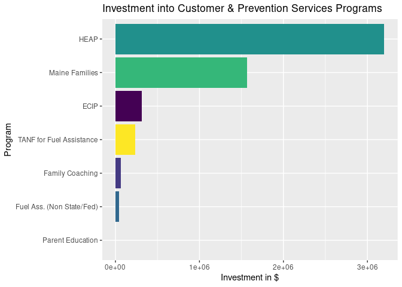
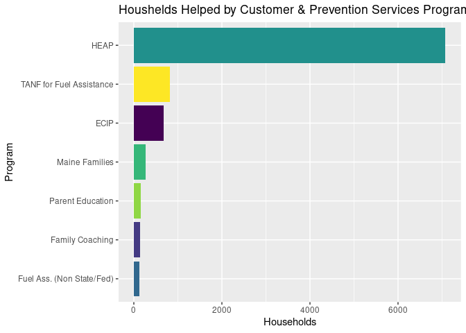

Project memo
================
Team name

This document should contain a detailed account of the data clean up for
your data and the design choices you are making for your plots. For
instance you will want to document choices you’ve made that were
intentional for your graphic, e.g. color you’ve chosen for the plot.
Think of this document as a code script someone can follow to reproduce
the data cleaning steps and graphics in your handout.

``` r
library(tidyverse)
library(broom)
library(readxl)
library(viridis)
library(dplyr)
library(tidyr)
library(ggrepel)
```

## Data Clean Up Steps for Overall Data

### Load Data

``` r
sept_kpis <- read_excel("../data/FY24 Sept KPIs - Total Agency.xlsx")
```

    ## New names:
    ## • `` -> `...2`
    ## • `` -> `...18`
    ## • `` -> `...19`

``` r
town_campaign <- read_excel("../data/FY24 Town Campaign Data.xlsx", sheet = 1, col_names = FALSE)
```

    ## New names:
    ## • `` -> `...1`
    ## • `` -> `...2`
    ## • `` -> `...3`
    ## • `` -> `...4`
    ## • `` -> `...5`
    ## • `` -> `...6`
    ## • `` -> `...7`
    ## • `` -> `...8`
    ## • `` -> `...9`
    ## • `` -> `...10`
    ## • `` -> `...11`
    ## • `` -> `...12`
    ## • `` -> `...13`
    ## • `` -> `...14`
    ## • `` -> `...15`
    ## • `` -> `...16`
    ## • `` -> `...17`
    ## • `` -> `...18`
    ## • `` -> `...19`
    ## • `` -> `...20`
    ## • `` -> `...21`
    ## • `` -> `...22`
    ## • `` -> `...23`
    ## • `` -> `...24`
    ## • `` -> `...25`
    ## • `` -> `...26`
    ## • `` -> `...27`
    ## • `` -> `...28`
    ## • `` -> `...29`
    ## • `` -> `...30`
    ## • `` -> `...31`
    ## • `` -> `...32`
    ## • `` -> `...33`
    ## • `` -> `...34`
    ## • `` -> `...35`
    ## • `` -> `...36`
    ## • `` -> `...37`
    ## • `` -> `...38`
    ## • `` -> `...39`
    ## • `` -> `...40`
    ## • `` -> `...41`
    ## • `` -> `...42`
    ## • `` -> `...43`
    ## • `` -> `...44`
    ## • `` -> `...45`
    ## • `` -> `...46`
    ## • `` -> `...47`
    ## • `` -> `...48`
    ## • `` -> `...49`
    ## • `` -> `...50`
    ## • `` -> `...51`
    ## • `` -> `...52`

### Step 1: Cleaning the KPIs dataset

``` r
#Department Column for kpis
sept_kpis <- sept_kpis |>
  rename("Department" = "Children's Services") 

sept_kpis[1, "Department"] <- "Children's Services"

sept_kpis <- sept_kpis |>
  fill(Department, .direction = "down")

#Program Column for kpis
sept_kpis <- sept_kpis |>
  rename("Program" = "...2") 

sept_kpis[1, "Program"] <- "Children's Services"
sept_kpis[24, "Program"] <- "Housing Services"
sept_kpis[82, "Program"] <- "Development"
sept_kpis[90, "Program"] <- "CCFC"
sept_kpis[103, "Program"] <- "Asset Management"
sept_kpis[107, "Program"] <- "Property Management"
sept_kpis[110, "Program"] <- "Finance"
sept_kpis[140, "Program"] <- "Human Resources"
sept_kpis[142, "Program"] <- "Open Positions"
sept_kpis[157, "Program"] <- "Time to Hire"
sept_kpis[172, "Program"] <- "Head Count"
sept_kpis[187, "Program"] <- "Turnover Rate"

sept_kpis <- sept_kpis |>
  fill(Program, .direction = "down")

sept_kpis <- sept_kpis[, -c(18, 19)]
```

### Step 2: Cleaning Town Campaign Dataset

``` r
town_campaign_cps <- town_campaign |>
  select(...1,...2,...3,...4,...5,...6,...7,...8,...9,...24,...25,...26,...27,...28, ...29)

town_campaign_cps <- town_campaign_cps |>
  rename(town = ...1, tanf_fuelass_households = ...2, tanf_fuelass_investment = ...3, fuelass_households = ...4, fuelass_investment = ...5, heap_households = ...6, heap_investment = ...7, ecip_households = ...8, ecip_investment = ...9,  family_coaching_households = ...24, family_coaching_investment = ...25, maine_families_households = ...26, maine_families_investment = ...27, parent_education_households = ...28, parent_education_investment = ...29 )

town_campaign_cps <- town_campaign_cps[-c(1, 2, 3, 4, 5, 6, 7, 8, 9), ]

town_campaign_cps <- town_campaign_cps[!apply(town_campaign_cps[, -1], 1, function(x) all(is.na(x))), ]
town_campaign_cps[, -1] <- lapply(town_campaign_cps[, -1], as.numeric)
```

    ## Warning in lapply(town_campaign_cps[, -1], as.numeric): NAs introduced by
    ## coercion
    ## Warning in lapply(town_campaign_cps[, -1], as.numeric): NAs introduced by
    ## coercion
    ## Warning in lapply(town_campaign_cps[, -1], as.numeric): NAs introduced by
    ## coercion
    ## Warning in lapply(town_campaign_cps[, -1], as.numeric): NAs introduced by
    ## coercion

``` r
town_campaign_cps[is.na(town_campaign_cps)] <- 0

totals <- colSums(town_campaign_cps[, -1])
town_campaign_cps <- bind_rows(town_campaign_cps, totals)


summary_data <- town_campaign_cps[-seq(1, 193), ]

summary_data <- summary_data|>
  pivot_longer(cols = -town,
               values_to = "value")

summary_data <- summary_data|>
  mutate(data_type = rep(c("households", "investment"), 
                         times = ncol(df) / 2, length.out = nrow(summary_data)),
         program = rep(c("tanf_fuelass", "fuelass", "heap", "ecip", 
                         "family_coaching", "maine_families", "parent_education"), 
                      each = 2, length.out = nrow(summary_data)))

summary_data_long <- summary_data[,-c(1, 2) ]

summary_data_wide <- summary_data_long |>
  pivot_wider(names_from = data_type, values_from = value)
```

## Plots

### Plot 1: Customer & Prevention Services Program Investments

``` r
ggplot(summary_data_wide, aes(x = reorder(program, investment), y = investment, fill = program)) +
  geom_bar(stat="identity", show.legend = FALSE) +
  scale_x_discrete(labels = c("ecip" = "ECIP", 
                              "family_coaching" = "Family Coaching", 
                              "fuelass" = "Fuel Ass. (Non State/Fed)",
                              "heap" = "HEAP",
                              "maine_families" = "Maine Families",
                              "parent_education" = "Parent Education",
                              "tanf_fuelass" = "TANF for Fuel Assistance")) +
  labs(title="Investment into Customer & Prevention Services Programs",
       x="Program", y="Investment in $") +
  coord_flip() +
  scale_fill_viridis_d()
```

<!-- -->

### Plot 2: Customer & Prevention Services Program Households Helped

``` r
ggplot(summary_data_wide, aes(x = reorder(program, households), y = households, fill = program)) +
  geom_bar(stat="identity", show.legend = FALSE) +
  scale_x_discrete(labels = c("ecip" = "ECIP", 
                              "family_coaching" = "Family Coaching", 
                              "fuelass" = "Fuel Ass. (Non State/Fed)",
                              "heap" = "HEAP",
                              "maine_families" = "Maine Families",
                              "parent_education" = "Parent Education",
                              "tanf_fuelass" = "TANF for Fuel Assistance")) +
  labs(title="Houshelds Helped by Customer & Prevention Services Programs",
       x="Program", y="Households") +
  coord_flip() +
  scale_fill_viridis_d()
```

<!-- -->

### Plot 3: \_\_\_\_\_\_\_\_\_\_\_

Add more plot sections as needed. Each project should have at least 3
plots, but talk to me if you have fewer than 3. \#### Data cleanup steps
specific to plot 1

These data cleaning sections are optional and depend on if you have some
data cleaning steps specific to a particular plot

### Plot 4: \_\_\_\_\_\_\_\_\_\_\_
